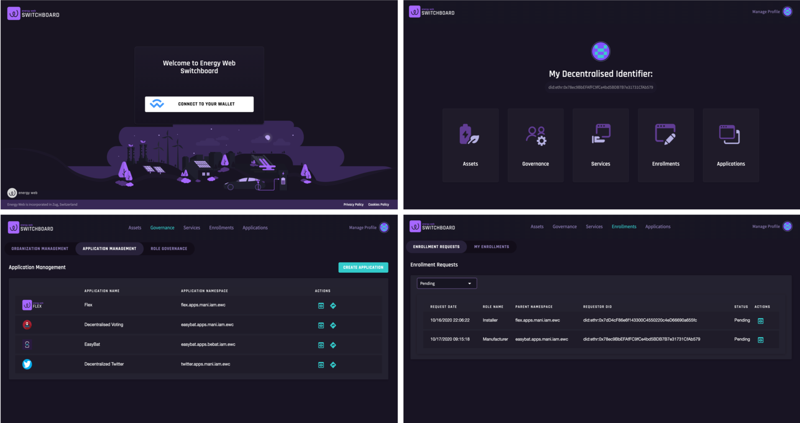

# Switchboard dApp

[](https://travis-ci.com/energywebfoundation/switchboard-dapp)

`Switchboard dApp` is a revolutionary decentralized application that allows management of identities, assets, applications, services and access controls with DIDs(Decentralised Identifiers) and VCs(Verifiable Credentials)

##



## Getting Started

These instructions will get you a copy of the project up and running on your local machine for development and testing purposes. See deployment for notes on how to deploy the project on a live system.

### Prerequisites

What things you need to install the software and how to install them

```
npm version 6+
nodejs version 10+
```

### Installing

A step by step series of examples that tell you how to get a development env running

Install dependencies:

```
npm install
```

### Running

Before you start You need to provide some secrets:
1. Execute `cp .env.example .env`
2. Fill in necessary variables

Run the project locally:

```
npm run start
```

Building project depends on Angular environments.

Build the project for development environment:

```
npm run build
```

Build the project for stedin environment:

```
npm run build-stedin
```

Build the project for staging environment:

```
npm run build-staging
```

Build the project for production:

```
npm run build-prod
```

## E2E Tests

E2E Tests for Switchboard and IAM stack are stored in [Switchboard-e2e](https://github.com/energywebfoundation/switchboard-e2e/)

## Active Maintainers

- Dawid Gil [@dawidgil](https://github.com/dawidgil)
- Whitney Purdum [@whitneypurdum](https://github.com/whitneypurdum)

## Contributing

Please read [CONTRIBUTING.md](https://gist.github.com/PurpleBooth/b24679402957c63ec426) for details on our code of conduct, and the process for submitting pull requests to us.

## License

This project is licensed under the GNU General Public License v3.0 or later - see the [LICENSE](LICENSE) file for details

## FAQ

Frequently asked questions and their answers will be collected here.
